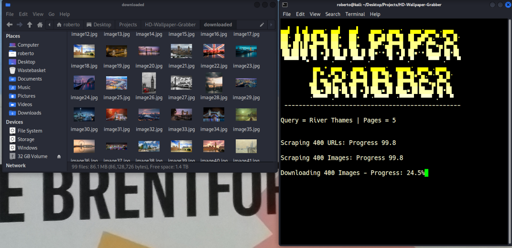

# HD-Wallpaper-Grabber

### Grab High Quality Wallpapers from your terminal

Requests wallpapers from 'Wallpaper Flare' from user search query, then downloads the results using threading.

Will grab links from every page existing from the user query and download every single wallpaper.

Since they are HD images it may take some time, which is greatly reduced by using concurrent.futures.

Only requires BS4 which is non-standard library.
